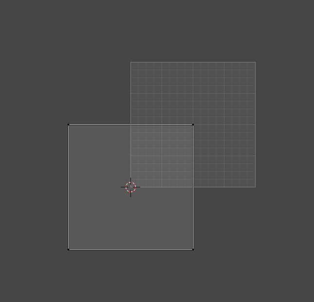
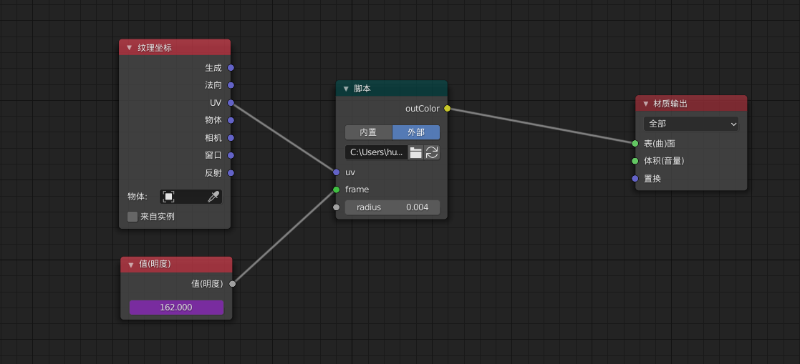
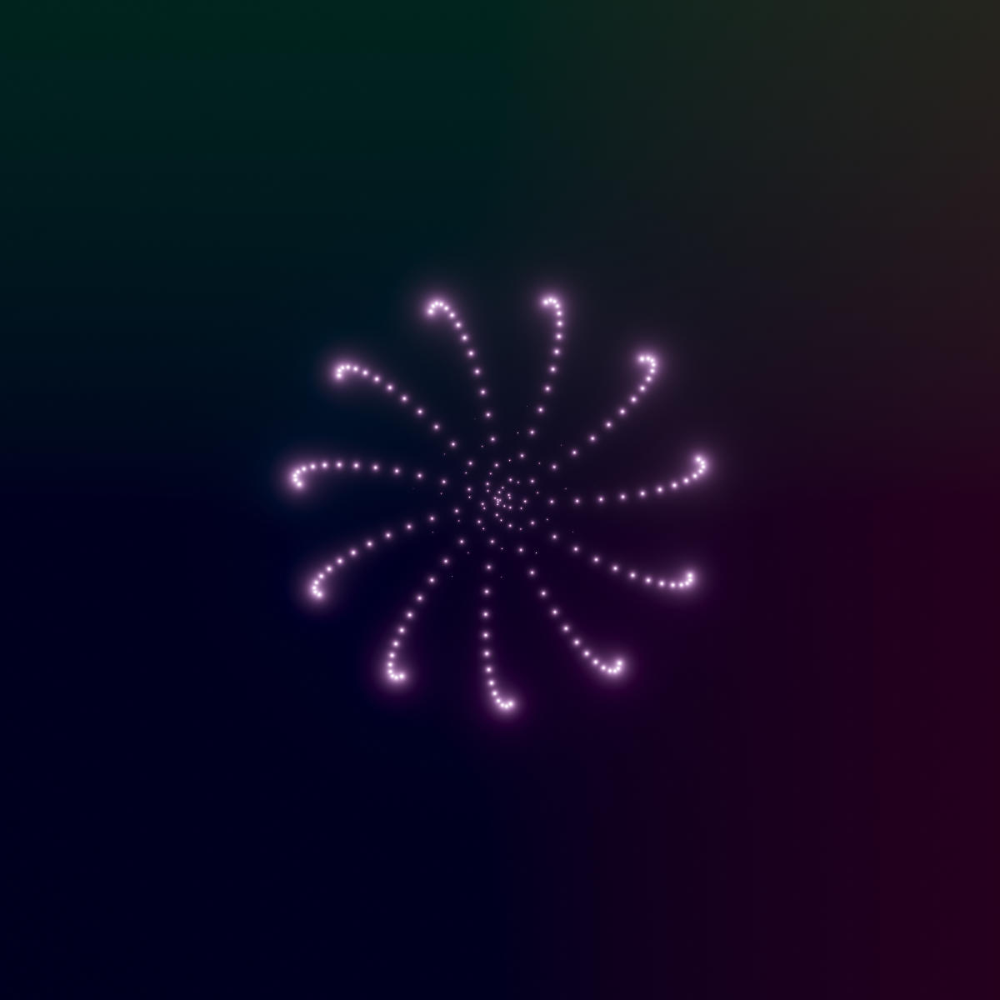

## 本Shader是从Shadertoy网站上的一个shader改写来的
原shader地址： https://www.shadertoy.com/view/4dlfR7

## 使用
1. 新建平面
2. 移动平面UV的中心点到原点

3. 修改渲染器未Cycles,勾选开放式着色语言（OSL），设置视图和渲染采样为1。 导入particle.osl, 输入UV 和当前帧数。当前帧数可新建明度节点，输入#frame。

3. 渲染输出

